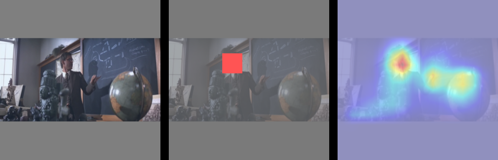

# Dual-Stream DNN Models Human Visual Cortex

This is an official repository for "**A Dual-Stream Neural Network Explains the Functional Segregation of Dorsal and Ventral Visual Pathways in Human Brains**", NeurIPS-23. 

[[Paper Preprint]](https://arxiv.org/pdf/2310.13849.pdf) 
[[NeurIPS-23 Poster (in preparation)]](https://neurips.cc/virtual/2023/poster/72233)


## Project Overview
Our research introduces a novel two-stream deep neural network that models the human dorsal and ventral visual pathways from the retina onwards.

### Key features of our model
- Eye movements
- Retina-like image sampling
- Two streams with distinct functions
    - Saliency prediction
    - Object recognition

### Implications
By building an accurate model of both the ventral and dorsal visual streams, 
- [Neuroscience] We have better understandings of our brains' visual cortex.
- [Machine Learning] Improvde machine learning models to better process/predict brain signals for neural interface and AR/VR applications. 

<p align="center">
    
</p>
<p align="center">
Figure 1. Overview of the project. 
</p>


### Front-End: Retinal Transformation & Eye movements
The network begins with a retinal transformation model, simulating the initial processing stage of visual information in the human eye.

### Back-End: Dorsal & Ventral Streams
- **Dorsal Stream (WhereCNN)**: This component mirrors the human dorsal visual stream, focusing on visual attention processing.
- **Ventral Stream (WhatCNN)**: The ventral stream counterpart in our model, WhatCNN is responsible for object recognition tasks.

Each stream receives distinct inputs, optimized for their specific functions, as illustrated in Figure 1.


## Retinal Transformation
Upon determining a fixation point, the WhereCNN directs the '**virtual eyes**', allowing the retina to sample the image at the selected location.

<p align="center">
    
</p>
<p align="center">
Figure 2. Input stimuli examples provided to the model (left) and the model-generated visual saliency maps (right).
</p>

See `retinal_sampling_examples.ipynb` for demo. 


## Visual Attention Generation
We exposed our model to a series of movie clips to observe the generation of learned visual attention. The resulting visual saliency maps accurately highlight the relevant locations in each frame (red regions). Then, the eyes are guided to the location with highest saliency. 

<p align="center">
   
  
</p>
<p align="center">
Figure 3. Examples of input stimuli given to the model (left), and visual saliency maps from the model (right)
</p>


## fMRI Activity Prediction
Utilizing the features extracted from our model, we predicted fMRI activities and demonstrated a significant alignment between the WhereCNN and WhatCNN with the human dorsal and ventral visual streams, respectively.

To measure alignment between the WhereCNN / WhatCNN to dorsal / ventral visual streams, we used fMRI data collected from human subjects during movie watching. The same movie is given to our model, and the features for each movie frame are collected. Based on the model features, we tried to predict voxel activities from human data. 

Model features (either from WhereCNN or WhatCNN) --> Prediction --> fMRI voxel activity (dorsal or ventral visual streams)


<p align="center">
    
</p>
<p align="center">
Figure 4. Model-to-Human Visual Cortex Comparison.
</p>

Figure 4(a) presents the cortical voxels colored by the explainability from the features of WhereCNN (warm-tone), WhatCNN (cool-tone). Warm colored voxels are better predicted by the features from WhereCNN, which is trained for saliency prediction, while the cool colored voxels are better predicted by the features from WhatCNN, which is trained for object recognition. 

In Figure 4(a), there are two notable patterns. 
1. WhereCNN better explains the pheriphery, while WhatCNN better exaplains fovea.
2. The dorsal visual stream is better explained by WhereCNN, while the ventral stream is for WhatCNN. 

In Figure 4(b), the explainability of the regions of interests from the ventral or dorsal visual stream are quantitatively measured. As can be seen in the graph, the ventral ROIs are better explained by the features of WhatCNN, and the dorsal ROIs are better explained by the features of WhereCNN. 

If we think about the functions of the two visual streams in our brain (dorsal stream for visual attention, ventral stream for object recognition), design a two-streamed deep neural network with distinct functions (saliency prediction and object recognition) improves the prediction performance of the brain signals. 


## Usage
### Install
```
pip install -r requirements.txt
```

### Run Demo
This repository includes example inputs to the model. You can simply run the code by first downloading our pretrained weights in the repository (In preparation). 
And the following command will give you the output attention from our model in `./plots`. 
```
python train.py
```
The expected outputs are included in the repository in `./plots`, and below is an example output. 

<p align="center">
    
</p>
<p align="center">
Figure 5. Example output from our code. Left: input image, Middle: fixation point made, Right: Saliency map.
</p>

## To-Do
- Pretrained model parameters will be uploaded soon.

