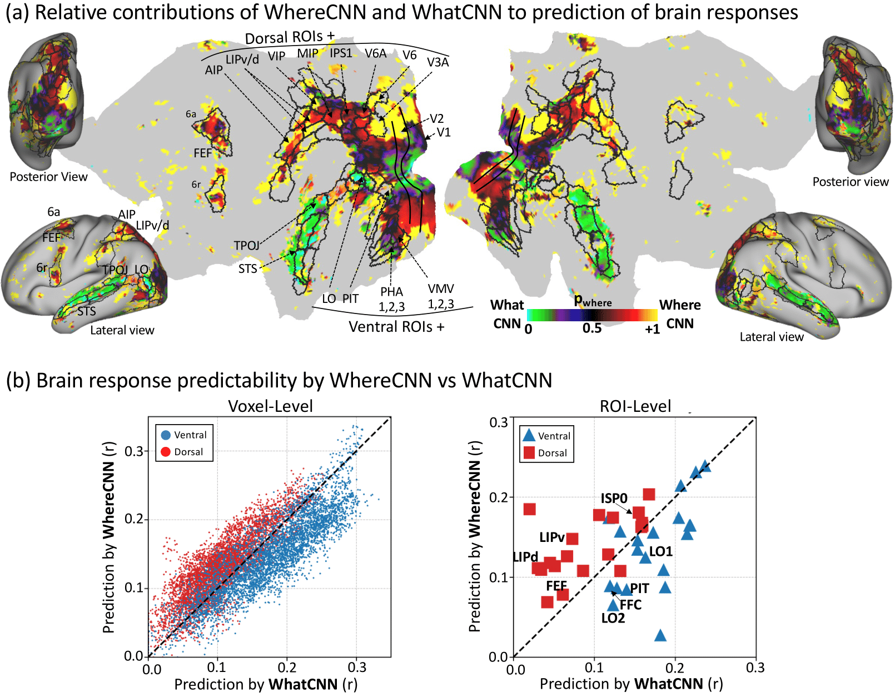

# Dual-Stream DNN Models Human Visual Cortex

This is an official repository for "**A Dual-Stream Neural Network Explains the Functional Segregation of Dorsal and Ventral Visual Pathways in Human Brains**", NeurIPS-23. 

[[Paper Preprint]](https://drive.google.com/file/d/1PfFPg3AwdL7IIUCSwuYoXW8L7UELxwN5/view?usp=drive_link) 
[[NeurIPS-23 Poster]](https://neurips.cc/virtual/2023/poster/72233)

## Project Overview
Our research introduces a novel two-stream deep neural network that models the human dorsal and ventral visual pathways from the retina onwards.

### Key features of our model
- Eye movements
- Retina-like image sampling
- Two streams with distinct functions
    - Saliency prediction
    - Object recognition

### Implications
By building an accurate model of both the ventral and dorsal visual streams, 
- [Neuroscience] We have better understandings of our brains.
- [Machine Learning] Improvde machine learning models to better process brain signals. 

    

Figure 1. Overview of the project. 

### Front-End: Retinal Transformation & Eye movements
The network begins with a retinal transformation model, simulating the initial processing stage of visual information in the human eye.

### Back-End: Dorsal & Ventral Streams
- **Dorsal Stream (WhereCNN)**: This component mirrors the human dorsal visual stream, focusing on visual attention processing.
- **Ventral Stream (WhatCNN)**: The ventral stream counterpart in our model, WhatCNN is responsible for object recognition tasks.

Each stream receives distinct inputs, optimized for their specific functions, as illustrated in Figure 1.

## Retinal Transformation
Upon determining a fixation point, the WhereCNN directs the '**virtual eyes**', allowing the retina to sample the image at the selected location.

    

Figure 2. Input stimuli examples provided to the model (left) and the model-generated visual saliency maps (right).

## Visual Attention Generation
We exposed our model to a series of movie clips to observe the generation of learned visual attention. The resulting visual saliency maps accurately highlight the relevant locations in each frame (red regions). Then, the eyes are guided to the location with highest saliency. 

   
  

Figure 3. Examples of input stimuli given to the model (left), and visual saliency maps from the model (right)

## fMRI Activity Prediction
Utilizing the features extracted from our model, we predicted fMRI activities and demonstrated a significant alignment between the WhereCNN and WhatCNN with the human dorsal and ventral visual streams, respectively.

    

Figure 4. Model-to-Human Visual Cortex Comparison.

## To-Do
- Codes and Model parameters will be uploaded soon.

